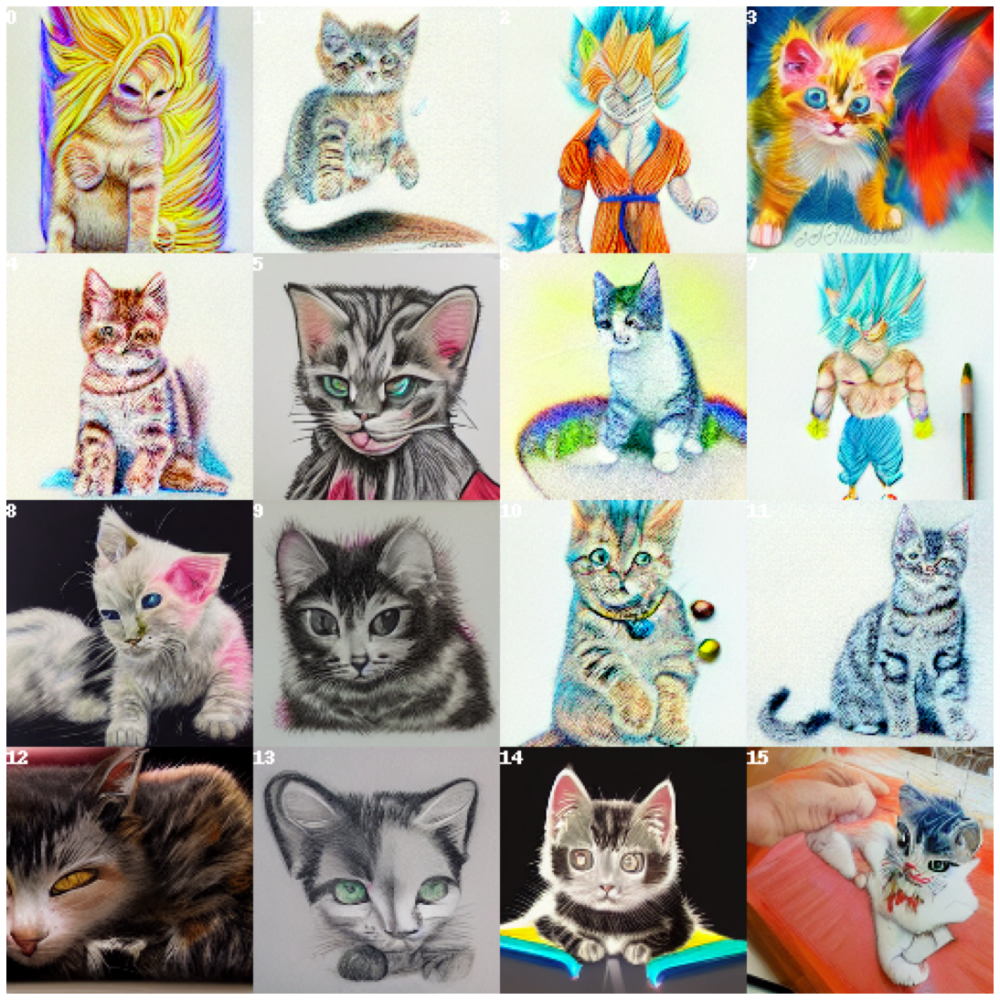
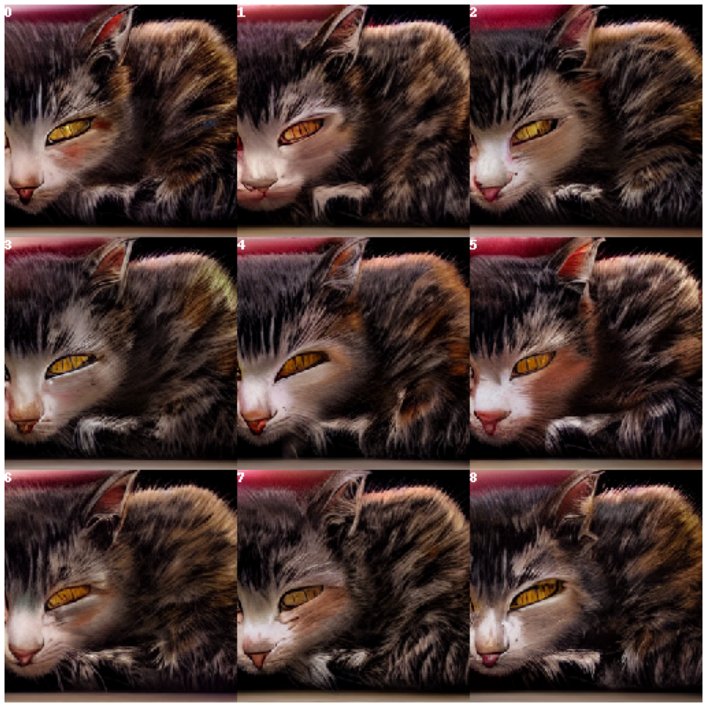
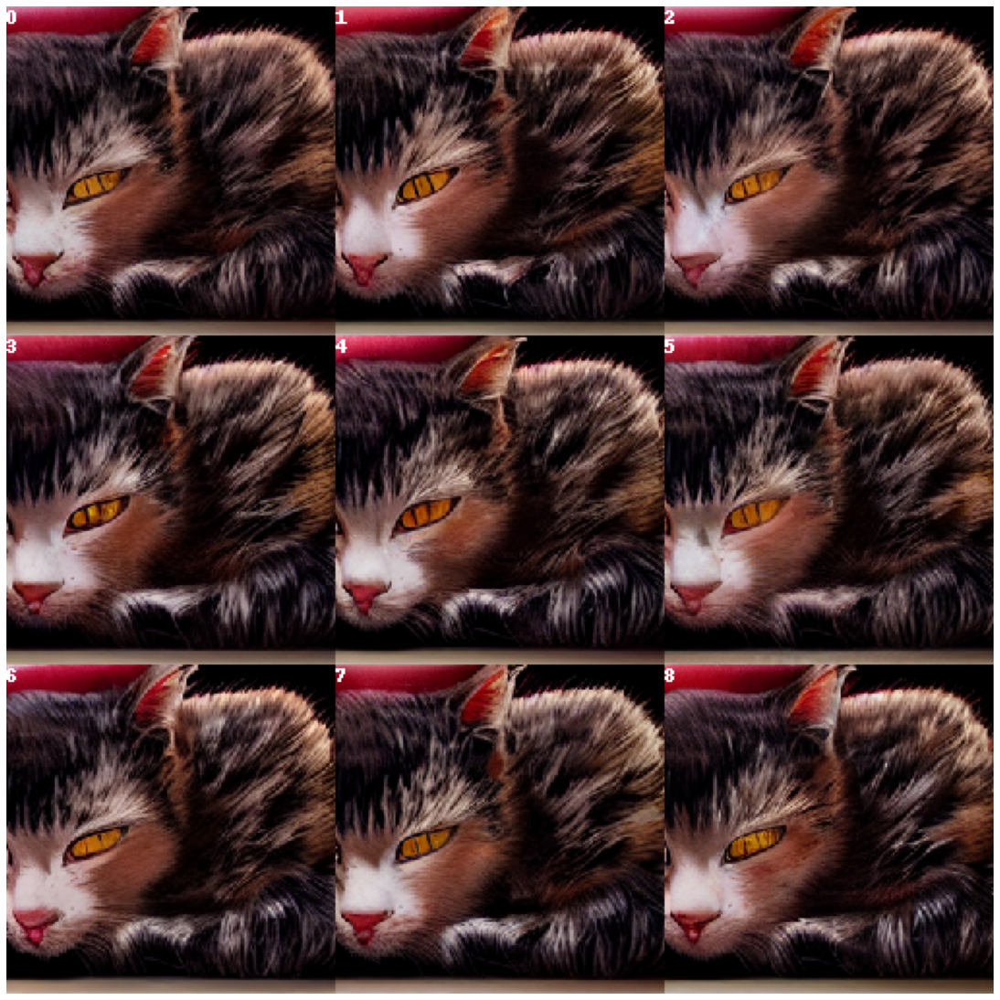
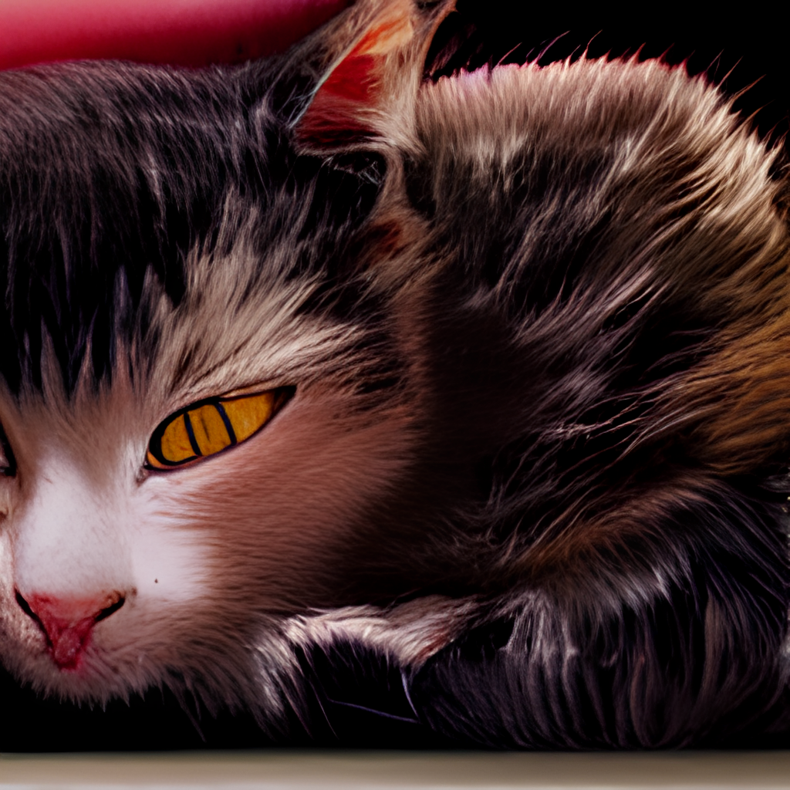
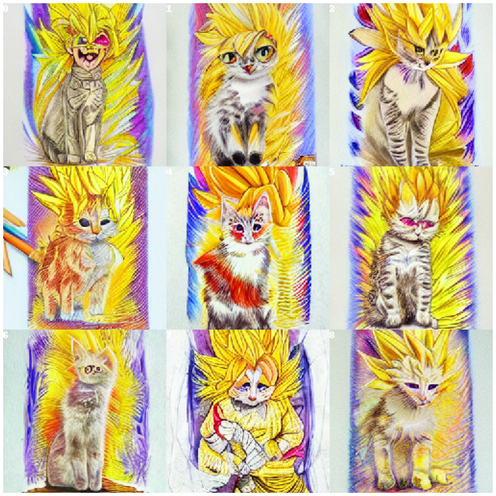
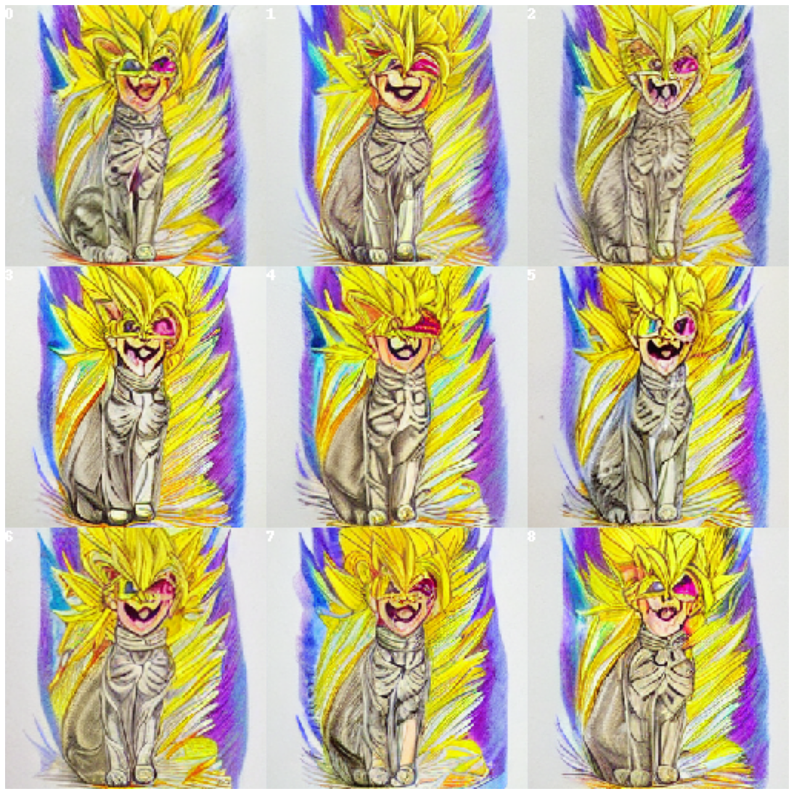
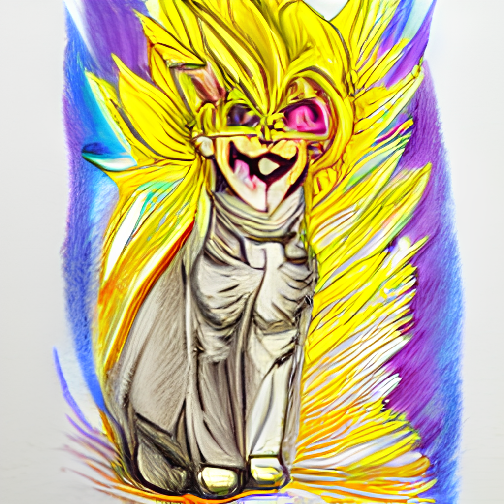

```python
%load_ext autoreload
%autoreload 2
from docarray import Document
from docarray.array.match import MatchArray
import sqlite3
import os
import io
import hashlib
import copy
from querytools import *
```


```python
# Start a query session with the default query database parameters (i.e. datastore location and backend url)
s = QuerySession(QueryDatabase())
```

```python
# Run a query against the dalle endpoint to generate some samples to explore
s.query('a visionary colored pencil drawing of a kitten going super saiyan')
```
a visionary colored pencil drawing of a kitten going super saiyan



```python
#Image 12 looks interesting lets run a diffusion around that image
s.diffuse(0.8,12)
```
a visionary colored pencil drawing of a kitten going super saiyan -- diffuse item[12] sr[0.8]



```python
# Let see if we can get a slightly better eye starting with sample 5
s.diffuse(0.9,5)
```
a visionary colored pencil drawing of a kitten going super saiyan -- diffuse item[12] sr[0.8] -- diffuse item[5] sr[0.9]



```python
# Image 1 is nice -- lets Upscale that and see what it looks like
s.upscale(1)
```



```python
# Lets see the graph of actions we took to get here
s.show_graph()
```

    a visionary colored pencil drawing of a kitten going super saiyan
    -- a visionary colored pencil drawing of a kitten going super saiyan -- diffuse item[12] sr[0.8]
    -- -- a visionary colored pencil drawing of a kitten going super saiyan -- diffuse item[12] sr[0.8] -- diffuse item[5] sr[0.9]
    -- -- -- a visionary colored pencil drawing of a kitten going super saiyan -- diffuse item[12] sr[0.8] -- diffuse item[5] sr[0.9] -- upscale


```python
# We can save an image of the current document as well
s.cur_doc.doc.save_image("supersaiyan.png")
```


```python
# Lets say we want to go back to the original document and explore a different path
s.show_stack()
```

    0 a visionary colored pencil drawing of a kitten going super saiyan -- children: [1]
    1 a visionary colored pencil drawing of a kitten going super saiyan -- diffuse item[12] sr[0.8] -- children: [1]
    2 a visionary colored pencil drawing of a kitten going super saiyan -- diffuse item[12] sr[0.8] -- diffuse item[5] sr[0.9] -- children: [1]
    3 a visionary colored pencil drawing of a kitten going super saiyan -- diffuse item[12] sr[0.8] -- diffuse item[5] sr[0.9] -- upscale -- children: [0]


```python
#The stack shows us different query states that we can jump back to -- if we want to jump to a specific point in the stack we can do so directly
s.set_stack_position(0)
```
Active Document: a visionary colored pencil drawing of a kitten going super saiyan

```python
#We can also go to the root with the goto_root function
s.goto_root()
```
Active Document: a visionary colored pencil drawing of a kitten going super saiyan

```python
# Notice that we are told what the new active document is
# Now lets display what the active node contains
s.show()
```

a visionary colored pencil drawing of a kitten going super saiyan


```python
# Lets dive into image 0 -- I want to explore the space around it a bit more widely
s.diffuse(0.5,0)
```

a visionary colored pencil drawing of a kitten going super saiyan -- diffuse item[0] sr[0.5]



```python
# 0 looks pretty interesting, lets see some variation on that
s.diffuse(0.8,0)
```

a visionary colored pencil drawing of a kitten going super saiyan -- diffuse item[0] sr[0.5] -- diffuse item[0] sr[0.8]



```python
#And lets upscale 3
s.upscale(3)
```



```python
# And we can see the entire graph that we have now
s.show_graph()
```

    a visionary colored pencil drawing of a kitten going super saiyan
    -- a visionary colored pencil drawing of a kitten going super saiyan -- diffuse item[12] sr[0.8]
    -- -- a visionary colored pencil drawing of a kitten going super saiyan -- diffuse item[12] sr[0.8] -- diffuse item[5] sr[0.9]
    -- -- -- a visionary colored pencil drawing of a kitten going super saiyan -- diffuse item[12] sr[0.8] -- diffuse item[5] sr[0.9] -- upscale
    -- a visionary colored pencil drawing of a kitten going super saiyan -- diffuse item[0] sr[0.5]
    -- -- a visionary colored pencil drawing of a kitten going super saiyan -- diffuse item[0] sr[0.5] -- diffuse item[0] sr[0.8]
    -- -- -- a visionary colored pencil drawing of a kitten going super saiyan -- diffuse item[0] sr[0.5] -- diffuse item[0] sr[0.8] -- upscale
