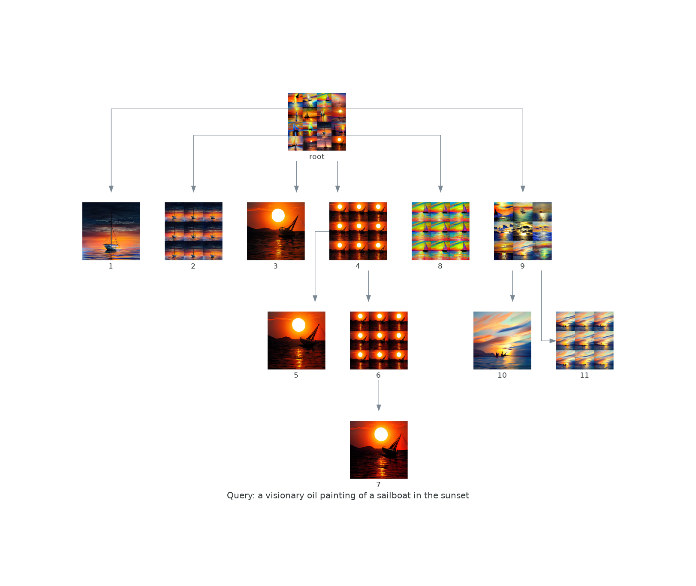

# dalle-flow-tools
Set of tools that allow you to save and recall the results of dalle-flow sessions so that you can come back and explore a given session further. To use these tools you need a dalle-flow endpoint. For instructions on setting up your own endpoint see [Dalle-Flow](https://github.com/jina-ai/dalle-flow). You can also use the public endpoint they have setup, but the response time is faster if you setup your own endpoint.

Using these tools you can keep track of the graph of operations that you take while exploring the query space starting from the root query. 

The library can generate the following graphs for a session and you can move between different frames to run diffuse and upscale operations at will.




There is also a simple SQLite database wrapper under the hood that lets you save sessions so you can come back to them later and continue your explorations.

# Installation
Eventually this will be pushed to a pip repository, for now clone this repository and install into your pip environment
```bash
> git clone https://github.com/jwelch1324/dalle-flow-tools.git
> pip install dalle-flow-tools/
```

# Getting Started
The documentation below is outdated and will be removed in the future -- see [Getting Started](ExampleSession/GettingStarted.md) instead.

# First use of the Database
When you first create a database you need to run the `initdb` function as follows
```python
qdb = QueryDatabase()
qdb.initdb()
```

This is to create the main table in the database

# QuerySession
For usage see the [Example Session](ExampleSession/README.md)
It is recommended to use the query session rather than the raw query documents if you want to track your workflow.

# The data store and database
The querytools introduce two classes the QueryDocument() and QueryDatabase() -- the former is a wrapper around the dalle-flow docarray interface, and the latter is a simple SQLLite wrapper that manages storing session data. Additionally when the database is first instantiated it will create a datastore cache, which is an organized set of folders corresponding to the first four hex characters of an md5 hash. When a query document is saved to the database, it is converted to raw bytes, hashed, and then saved to the appropriate bucket in the datastore.

# QueryDocument
## Saving / Restoring a query document
Lets say you have a query document that you want to save for later -- you can easily save it to the database using the `save_qd` function
```python
qd = QueryDocument()
qd.query('a photo of a happy puppy')
qdb.save_qd(qd)
```

Later when you want to recall the document you can use the database to find the query and rebuild the QueryDocument object
```python
qdb.show_queries()
#OUTPUT: 0 a photo of a happy puppy
```
we see that there is a stored session with the query `a photo of a happy puppy` in the database at index 0, to rebuild the document for this we just need to pass the hash to the `rebuild_doc` function
```python
#If the dalle-flow-endpoint variable is not specified it will use the default which is grpc://10.10.28.110:51005 -- you can set the default in the querytools.py file
rqd = qdb.rebuild_doc(qdb.get_hash_from_list(0),dalle_flow_endpoint="grpc://10.10.28.110:51005")
```

now `rqd` will be the same QueryDocument object as before, and you can continue to operate on the session as normal


## Show Tiles
if you run the `show_tiles` function you will get a plot of all the current images with their index in the current query doc.

## Diffusing
There is a function `diffuse` which takes as its arguments `skip_rate` and `idx` (idx is optional, and defaults to 0). This will run a diffusion on the image at index `idx` within the current document and return a new QueryDocument that contains the session information for the diffusion operation. It will also append the line `diffusion idx[#] sr[skip_rate]` to the text entry of each item in the document so that if you save it to the database you will see an extended version of the original query to make it easier to differentate it from the original doc.

# Upscale
There is an `upscale` function that takes the index from the output of `show_tiles` and runs it through the upscaling endpoint. It returns a new QueryDocument that contains the upscaled image only.

# Save Image
There is a `save_image` function that can be used to write the URI data in the document to an image file.

# TODO 
Many things to do probably -- but the most immediate one would be adding simple CRUD like operations -- in particular removing entries that we no longer want. 


